# Upgrade Plan: .NET 5.0 to .NET 10.0

**Date**: 2025-01-25  
**Strategy**: All-At-Once  
**Solution**: Covers.sln  
**Current Framework**: .NET 5.0  
**Target Framework**: .NET 10.0 (LTS)

---

## Executive Summary

This plan outlines the upgrade of the Covers solution from .NET 5.0 to .NET 10.0 (Long Term Support). The solution contains a single ASP.NET Core project, making it an ideal candidate for the All-At-Once upgrade strategy.

### Selected Strategy
**All-At-Once Strategy** - All projects upgraded simultaneously in a single operation.

**Rationale**: 
- Single project (minimal solution)
- Currently on .NET 5.0 (modern .NET)
- SDK-style project (already modernized)
- All packages have .NET 10.0 compatible versions available
- Simple dependency structure (no inter-project dependencies)
- Low risk due to solution size

### Key Metrics from Assessment
- **Total Projects**: 1
- **Total NuGet Packages**: 10 (6 need upgrade)
- **Total Code Files**: 51 (1 with potential incidents)
- **Total Lines of Code**: 3,099
- **Estimated LOC Impact**: 0+ lines (at least 0.0% of codebase)
- **Upgrade Difficulty**: 🟢 Low

---

## Dependency Analysis

### Project Structure

```mermaid
flowchart LR
    P1["📦 Covers.csproj<br/><small>net5.0 → net10.0</small>"]
```



**Covers.csproj**
- **Type**: ASP.NET Core Application
- **Current TFM**: net5.0
- **Target TFM**: net10.0
- **Dependencies**: None
- **Dependants**: None
- **Risk Level**: 🟢 Low

### Upgrade Order

Since there is only one project with no dependencies, the upgrade is straightforward:
1. **Phase 1**: Upgrade Covers.csproj (atomic operation)

---

## Package Update Reference

### Packages Requiring Updates

| Package | Current Version | Target Version | Projects | Reason |
|:--------|:---------------:|:--------------:|:---------|:-------|
| **Magick.NET-Q8-AnyCPU** | 7.22.3 | 14.10.2 | Covers.csproj | 🔴 **Security Vulnerability** |
| Microsoft.AspNetCore.SpaServices.Extensions | 5.0.1 | 10.0.3 | Covers.csproj | Framework upgrade |
| Microsoft.EntityFrameworkCore.Design | 5.0.1 | 10.0.3 | Covers.csproj | Framework upgrade |
| Microsoft.EntityFrameworkCore.Proxies | 5.0.1 | 10.0.3 | Covers.csproj | Framework upgrade |
| Microsoft.EntityFrameworkCore.Sqlite | 5.0.1 | 10.0.3 | Covers.csproj | Framework upgrade |
| Microsoft.EntityFrameworkCore.Tools | 5.0.1 | 10.0.3 | Covers.csproj | Framework upgrade |

### Packages Remaining Compatible

| Package | Current Version | Projects | Status |
|:--------|:---------------:|:---------|:-------|
| NSwag.AspNetCore | 13.9.4 | Covers.csproj | ✅ Compatible |
| SpotifyAPI.Web | 6.0.0 | Covers.csproj | ✅ Compatible |
| SpotifyAPI.Web.Auth | 6.0.0 | Covers.csproj | ✅ Compatible |
| TagLibSharp | 2.2.0 | Covers.csproj | ✅ Compatible |

### Critical Security Issue

⚠️ **Magick.NET-Q8-AnyCPU** has a security vulnerability in version 7.22.3 and must be upgraded to 14.10.2 as part of this upgrade.

---

## Breaking Changes Analysis

### .NET 5.0 → .NET 10.0 Major Breaking Changes

Upgrading from .NET 5.0 to .NET 10.0 spans five major releases (.NET 6, 7, 8, 9, and 10). Key breaking changes to watch for:

#### ASP.NET Core Changes
1. **Minimal Hosting Model** (introduced .NET 6)
   - The project uses Startup.cs pattern which is still supported
   - No immediate breaking changes expected, but could modernize to minimal APIs

2. **Authentication/Authorization**
   - Potential changes in middleware ordering requirements
   - Monitor for deprecation warnings

3. **Configuration**
   - appsettings.json schema changes may be present
   - Check for deprecated configuration options

#### Entity Framework Core Changes
1. **EF Core 6-10 Migrations**
   - Database migrations may need regeneration
   - SQL generation improvements may affect existing migrations
   - Check for behavioral changes in query execution

2. **Proxies Package**
   - Lazy loading behavior may have subtle changes
   - Verify proxy generation works as expected

#### Known API Removals
- Based on assessment: **0 binary incompatible APIs** detected
- Based on assessment: **0 source incompatible APIs** detected
- Based on assessment: **0 behavioral changes** detected

**Risk Assessment**: Low - No known breaking API changes detected in the codebase.

---

## Implementation Plan

### Phase 1: Prerequisites and Setup

**Objective**: Ensure environment is ready for upgrade

**Tasks**:
1. **Verify .NET 10 SDK Installation**
   - Confirm .NET 10.0 SDK is installed on the build machine
   - Path: D:\a\Covers\Covers\Covers.sln

2. **Validate global.json Compatibility**
   - Check if global.json exists in solution directory or parent directories
   - Ensure SDK version is compatible with .NET 10.0
   - Update if necessary

3. **Baseline Build**
   - Build the solution on current framework (.NET 5.0) to establish baseline
   - Document any existing warnings
   - Ensure clean build before proceeding

4. **Source Control Checkpoint**
   - Current branch: copilot/upgrade-covers-sln-to-dotnet-10-please-work
   - Ensure working tree is clean
   - All changes will be committed in a single commit after successful upgrade

### Phase 2: Atomic Framework and Package Upgrade

**Objective**: Update project file with new target framework and package versions

**Tasks**:

1. **Update Target Framework**
   - File: `Covers.csproj`
   - Change: `<TargetFramework>net5.0</TargetFramework>` → `<TargetFramework>net10.0</TargetFramework>`
   
2. **Update Package References**
   Update the following PackageReference elements in Covers.csproj:
   
   ```xml
   <!-- Security vulnerability - CRITICAL -->
   <PackageReference Include="Magick.NET-Q8-AnyCPU" Version="14.10.2" />
   
   <!-- ASP.NET Core packages -->
   <PackageReference Include="Microsoft.AspNetCore.SpaServices.Extensions" Version="10.0.3" />
   
   <!-- Entity Framework Core packages -->
   <PackageReference Include="Microsoft.EntityFrameworkCore.Design" Version="10.0.3">
     <IncludeAssets>runtime; build; native; contentfiles; analyzers; buildtransitive</IncludeAssets>
     <PrivateAssets>all</PrivateAssets>
   </PackageReference>
   <PackageReference Include="Microsoft.EntityFrameworkCore.Proxies" Version="10.0.3" />
   <PackageReference Include="Microsoft.EntityFrameworkCore.Sqlite" Version="10.0.3" />
   <PackageReference Include="Microsoft.EntityFrameworkCore.Tools" Version="10.0.3">
     <IncludeAssets>runtime; build; native; contentfiles; analyzers; buildtransitive</IncludeAssets>
     <PrivateAssets>all</PrivateAssets>
   </PackageReference>
   ```

   **Note**: Compatible packages (NSwag.AspNetCore, SpotifyAPI.Web, SpotifyAPI.Web.Auth, TagLibSharp) require no changes.

3. **Restore Dependencies**
   - Run: `dotnet restore Covers.sln`
   - Verify all packages restore successfully
   - Check for any dependency conflicts

### Phase 3: Build and Compilation

**Objective**: Identify and fix all compilation errors

**Tasks**:

1. **Initial Build Attempt**
   - Run: `dotnet build Covers.sln --configuration Release --no-restore`
   - Capture all errors and warnings
   - Categorize by type (API changes, package issues, obsolete warnings)

2. **Fix Compilation Errors**
   - Address any API compatibility issues
   - Update obsolete API usage
   - Fix namespace changes if any
   - Resolve any new analyzer warnings

3. **Achieve Warning-Free Build**
   - Target: **Zero warnings**
   - Address all nullable reference warnings if enabled
   - Fix any new code analysis issues
   - Update code to follow .NET 10 best practices

**Expected Issues**:
- Based on assessment: 0 API incompatibilities detected
- Likely issues: Obsolete API warnings, new analyzer rules
- EF Core migration warnings (migrations may need regeneration)

### Phase 4: Code Review and Adjustments

**Objective**: Review and update code patterns for .NET 10

**Tasks**:

1. **Review Configuration Files**
   - Check appsettings.json and appsettings.Development.json for deprecated options
   - Review Startup.cs for middleware ordering
   - Verify logging configuration

2. **Review Program.cs**
   - Check for obsolete host builder patterns
   - Consider modernization opportunities (optional)

3. **Review Entity Framework Code**
   - Files to check:
     - Migration files in Migrations folder (if exists)
     - DbContext configurations
     - Model configurations
   - Verify proxy behavior still works correctly

4. **SignalR Hubs Review**
   - Review files in Hubs\ directory
   - Check for any deprecated SignalR APIs

5. **Background Services Review**
   - Review files in BackgroundServices\ directory
   - Check for any changes in IHostedService patterns

### Phase 5: Testing and Validation

**Objective**: Ensure application works correctly on .NET 10

**Tasks**:

1. **Build Validation**
   - ✅ Solution builds without errors
   - ✅ Solution builds without warnings
   - ✅ All projects target net10.0
   - ✅ All package updates applied

2. **Runtime Testing**
   - Run the application locally
   - Test database connectivity (SQLite)
   - Test SignalR hub connections
   - Test Spotify API integration
   - Test background services
   - Test SPA serving (ClientApp)

3. **Dependency Audit**
   - Run: `dotnet list package --vulnerable`
   - Verify Magick.NET security issue is resolved
   - Check for any remaining vulnerable dependencies

4. **Package Verification**
   - Run: `dotnet list package --outdated`
   - Document any remaining packages that could be updated (non-blocking)

5. **Performance Baseline**
   - Compare startup time with .NET 5.0 baseline (if available)
   - Check memory usage patterns
   - Document any performance improvements

### Phase 6: Source Control and Documentation

**Objective**: Commit changes and document the upgrade

**Tasks**:

1. **Single Commit Strategy**
   - Review all changes made
   - Create comprehensive commit message:
     ```
     Upgrade solution from .NET 5.0 to .NET 10.0
     
     - Update Covers.csproj target framework to net10.0
     - Upgrade Microsoft.AspNetCore.SpaServices.Extensions to 10.0.3
     - Upgrade Entity Framework Core packages to 10.0.3
     - Upgrade Magick.NET-Q8-AnyCPU to 14.10.2 (security fix)
     - Fix compilation warnings for .NET 10
     - All tests passing
     - Zero warnings in build
     ```

2. **Tag the Commit** (optional)
   - Tag: `upgrade/net10.0`
   - Marks the successful upgrade point

---

## Risk Management

### Identified Risks

| Risk | Likelihood | Impact | Mitigation |
|:-----|:----------:|:------:|:-----------|
| **EF Core migration compatibility issues** | Medium | Medium | Test database migrations in development environment first; regenerate if needed |
| **Magick.NET API breaking changes (7.x → 14.x)** | Medium | High | Review Magick.NET usage in code; test image processing functionality thoroughly |
| **SpaServices.Extensions deprecation** | Low | Medium | Microsoft.AspNetCore.SpaServices.Extensions may be deprecated; consider alternatives if issues arise |
| **SignalR protocol changes** | Low | Medium | Test all hub connections; verify client-server communication |
| **Startup.cs pattern deprecation warnings** | Low | Low | While still supported, may see recommendations to use minimal hosting model |

### Rollback Plan

If critical issues are encountered:

1. **Immediate Rollback**
   - Run: `git reset --hard HEAD~1` (if committed)
   - Or: `git checkout .` (if not committed)
   - Restore: `dotnet restore`
   - Build: `dotnet build`

2. **Partial Rollback Options**
   - Revert to .NET 9.0 or .NET 8.0 (LTS) as intermediate step
   - Keep package updates, rollback only framework version
   - Address specific issues before re-attempting .NET 10

3. **Investigation Period**
   - Document specific failure points
   - Research breaking changes in affected areas
   - Seek community solutions for specific issues

### Success Criteria Validation

Before considering upgrade complete, verify:

- ✅ Covers.csproj targets net10.0
- ✅ All 6 package updates applied
- ✅ Magick.NET security vulnerability resolved
- ✅ Solution builds with zero errors
- ✅ Solution builds with zero warnings
- ✅ Application runs successfully
- ✅ Database operations work correctly
- ✅ SignalR functionality works
- ✅ Spotify API integration works
- ✅ Image processing (Magick.NET) works
- ✅ No vulnerable packages remain
- ✅ Changes committed to source control

---

## Timeline Estimate

Given the small scope (1 project, 3,099 LOC):

| Phase | Estimated Time | Notes |
|:------|:--------------:|:------|
| Prerequisites and Setup | 15 minutes | SDK check, baseline build |
| Framework and Package Upgrade | 10 minutes | Update project file |
| Build and Compilation | 30 minutes | Initial build, fix warnings |
| Code Review and Adjustments | 45 minutes | Review Magick.NET usage, EF Core migrations |
| Testing and Validation | 1 hour | Thorough functional testing |
| Source Control and Documentation | 15 minutes | Commit and documentation |
| **Total** | **~2.5 hours** | Single developer, uninterrupted |

**Confidence Level**: High - Simple solution structure, modern starting point (.NET 5.0), all packages have clear upgrade paths.

---

## Technology-Specific Considerations

### Entity Framework Core 5.0 → 10.0

**Key Changes**:
- EF Core 10.0 includes performance improvements and new features
- Existing migrations should remain compatible
- Consider regenerating migrations if issues occur
- Lazy loading with proxies should continue to work

**Testing Focus**:
- Database connection
- CRUD operations
- Lazy loading behavior
- Migration application

### ASP.NET Core 5.0 → 10.0

**Key Changes**:
- Middleware pipeline improvements
- Enhanced minimal API support (not used in current project)
- Authentication/authorization refinements

**Testing Focus**:
- Application startup
- Middleware order
- SPA serving
- SignalR hubs

### Magick.NET 7.22.3 → 14.10.2

**Major Version Jump**:
- This is a significant version upgrade (7 major versions)
- API may have breaking changes
- Review all usages in the codebase

**Testing Focus**:
- Image loading/saving
- Image manipulation operations
- File format support
- Memory usage patterns

**Code Areas to Review**:
- Search for `using ImageMagick` statements
- Review any image processing controllers
- Test all image manipulation features

---

## Post-Upgrade Opportunities

After successful upgrade, consider:

1. **Modernize to Minimal APIs** (Optional)
   - The project currently uses Startup.cs pattern
   - Could modernize to Program.cs minimal hosting model
   - Benefits: Reduced boilerplate, modern patterns

2. **Update SPA Integration** (Optional)
   - SpaServices.Extensions is in maintenance mode
   - Consider Vite or other modern SPA proxies
   - Evaluate if still needed

3. **Enable Nullable Reference Types**
   - If not already enabled
   - Benefits: Better null safety

4. **Adopt Latest C# Features**
   - C# 13 features available in .NET 10
   - File-scoped types, collection expressions, etc.

5. **Performance Profiling**
   - Baseline performance on .NET 10
   - Identify any optimization opportunities
   - Leverage .NET 10 performance improvements

---

## Success Criteria Summary

The upgrade is considered successful when:

### Technical Criteria
- ✅ All projects target net10.0
- ✅ All 6 package updates applied (especially security fix)
- ✅ Solution builds without errors
- ✅ Solution builds without warnings
- ✅ No package dependency conflicts
- ✅ No security vulnerabilities remain

### Functional Criteria
- ✅ Application starts successfully
- ✅ Database operations work
- ✅ SignalR hubs connect and communicate
- ✅ Spotify API integration functions
- ✅ Image processing works (Magick.NET)
- ✅ SPA serves correctly
- ✅ Background services run

### Quality Criteria
- ✅ All functionality tested and working
- ✅ No performance regressions
- ✅ No new runtime errors
- ✅ Clean git history with single comprehensive commit

---

## Appendix: File Locations

### Project Files
- **Covers.csproj**: `D:\a\Covers\Covers\Covers.csproj`

### Configuration Files
- **appsettings.json**: `D:\a\Covers\Covers\appsettings.json`
- **appsettings.Development.json**: `D:\a\Covers\Covers\appsettings.Development.json`

### Key Code Directories
- **Controllers**: `D:\a\Covers\Covers\Controllers\`
- **Models**: `D:\a\Covers\Covers\Models\`
- **Services**: `D:\a\Covers\Covers\Services\`
- **Hubs**: `D:\a\Covers\Covers\Hubs\`
- **BackgroundServices**: `D:\a\Covers\Covers\BackgroundServices\`
- **ClientApp**: `D:\a\Covers\Covers\ClientApp\`

### Entry Points
- **Program.cs**: `D:\a\Covers\Covers\Program.cs`
- **Startup.cs**: `D:\a\Covers\Covers\Startup.cs`

---

*This plan serves as the blueprint for the Execution stage, where these changes will be systematically applied and validated.*
